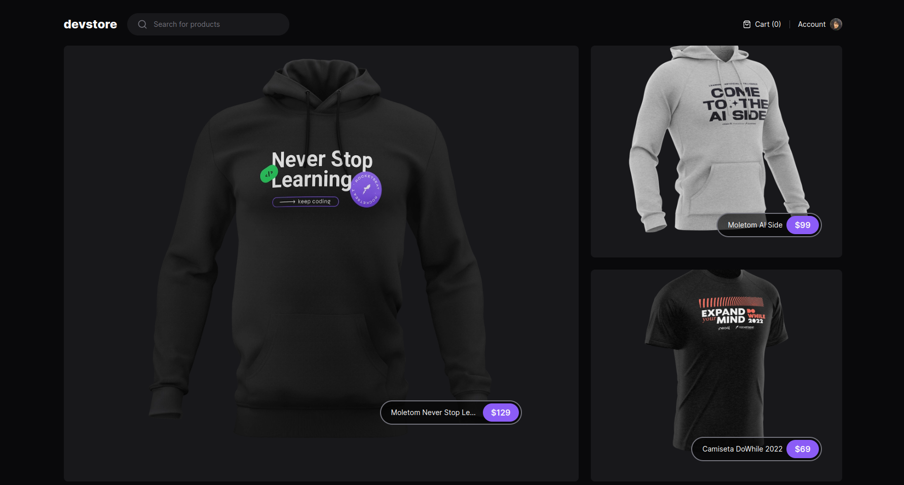
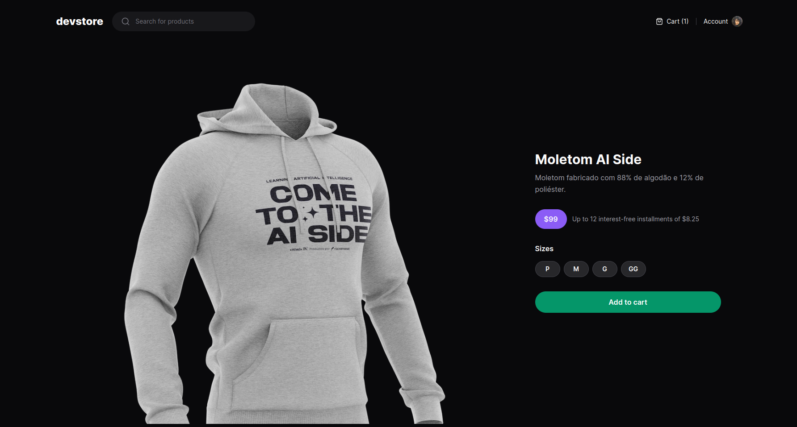

<div style="display: flex; justify-content: center; gap: 4px;">
  
     
</div>

<br>

<div style="display: flex; justify-content: center;">
  <a href="#memo-project">Project</a>&nbsp;&nbsp;&nbsp;|&nbsp;&nbsp;&nbsp;
  <a href="#rocket-technologies">Technologies</a>&nbsp;&nbsp;&nbsp;|&nbsp;&nbsp;&nbsp;
  <a href="#clipboard-requirements">Requirements</a>&nbsp;&nbsp;&nbsp;|&nbsp;&nbsp;&nbsp;
  <a href="#keyboard-how-to-run-the-project ">How to run the project </a>&nbsp;&nbsp;&nbsp;|&nbsp;&nbsp;&nbsp;
</div>
<br>

---

## :memo: Project 

This course covered Next.JS App Router and Tests.

**Overview of Next.js:**
In this module, we explore Next.js, a well-known framework within the React ecosystem. Next.js offers a broad range of common functionalities for React applications, emphasizing conventions for structuring applications, code writing, and library utilization. It's highly recommended by React's own documentation for building new applications. The session involves creating a project using Next.js, exploring folder structures, generated files, and configuring ESLint for improved code quality.

**Next.js Conventions and Routing:**
The routing in Next.js is file-based, meaning each file within the "app" folder automatically generates a new route in the application. This convention enables easy creation of various layouts for different application sections, allowing both global and specific layouts to be defined.

**Differences Between Next.js and Traditional React Apps:**
The traditional React app involves direct frontend access, requiring the user to wait for file loading, potentially resulting in a blank screen until everything loads. Next.js introduces Server-Side Rendering (SSR), where the Node.js server renders only the necessary files for the user's accessed page, sending ready HTML without the need for complete JavaScript loading in the browser. This architecture enables fetching data from the API on the server side, simplifying data transition between the API and the application.

**Server Components in Next.js:**
Server Components, a Next.js feature, render pure HTML without associated JavaScript, eliminating unnecessary JavaScript sent to the browser. However, they have limitations in executing client-side JavaScript-dependent functionalities. Client Components, on the other hand, provide interactivity and send the necessary JavaScript to the browser, undergoing a hydration process to transform HTML into interactive content with JavaScript.

**Dynamic Routing and Asynchronous Loading in Next.js:**
Exploration of techniques for creating dynamic routes, parameterized routes using brackets, accessing parameters within page components, and handling multiple parameters in URLs using specific methodologies to improve performance and SEO.

**Context Usage and Component Structuring in Next.js:**
Leveraging React's context for creating both client-side and server-side components, emphasizing component isolation for minimal JavaScript sent to the browser.

**Dynamic Metadata Generation and Static Site Generation in Next.js:**
Dynamic metadata generation for SEO optimization, emphasizing the significance of metadata for composing HTML header tags, customizing metadata for each page using templates and fallback options. Exploring static site generation to create a cached version of pages pre-publication for instant access.

**Shopping Cart and API Integration:**
Implementing a shopping cart functionality using React's context, creating a context and provider to manage cart items, and leveraging API calls within Next.js for seamless data retrieval.

**Testing and Deployment with Cypress and GitHub Actions:**
Introduction to end-to-end testing using Cypress, focusing on simulating typical e-commerce flows. Utilizing Cypress for testing UI, actions, and ensuring consistent application behavior. Setting up GitHub Actions workflows to automate testing on commits, including deployment strategies for APIs using Vercel platform.

**Enhancing Application Readiness: Managing Environment Variables in Next.js**

This segment focuses on enhancing our application for production readiness, diving into environment variable management and the distinction between server-side and client-side variables.

In the Next.js framework, variables aimed for client-side access demand the NEXT_PUBLIC prefix, while those confined to the server side operate without this prefix. To simplify this differentiation, we'll implement the 't3-env' package—a nimble solution leveraging Zod to robustly validate environment variables.


This is a project developed during React bootcamp **[Ignite](https://github.com/Rocketseat)**, run by **[@Rocketseat](https://github.com/Rocketseat)**.

<br>

---

## :rocket: Technologies ##

This project was developed using the following technologies:

- [React](https://pt-br.reactjs.org/)
- [TypeScript](https://www.typescriptlang.org/)
- [Next](https://nextjs.org/)
- [Tailwindcss](https://tailwindcss.com/)
- [Zod](https://github.com/colinhacks/zod)
- [Cypress](https://www.cypress.io/)

<br>

---

## :clipboard: Requirements

Before starting you need :checkered_flag:, have installed the [Git](https://git-scm.com) e [Node](https://nodejs.org/en/).

<br>

---
## :keyboard: How to run the project ##

```bash
# Clone this project
$ git clone git@github.com:Ca-byte/dev_store_nextjs.git

# Access
$ cd devstore

# Install dependencies
$ npm i

# Run the project
$ npm run dev

We've set up a backend on Vercel as we've integrated an API into the project for educational purposes before deployment.
[ignite-devstore-api](https://github.com/rocketseat-education/ignite-devstore-api)

# The server will initialize in the <http://localhost:3000/>

```
<br>

---

<a href="#top">☝</a>

<p style="text-align: center;">Developed with 💜 by Caroline Vieira</p>
